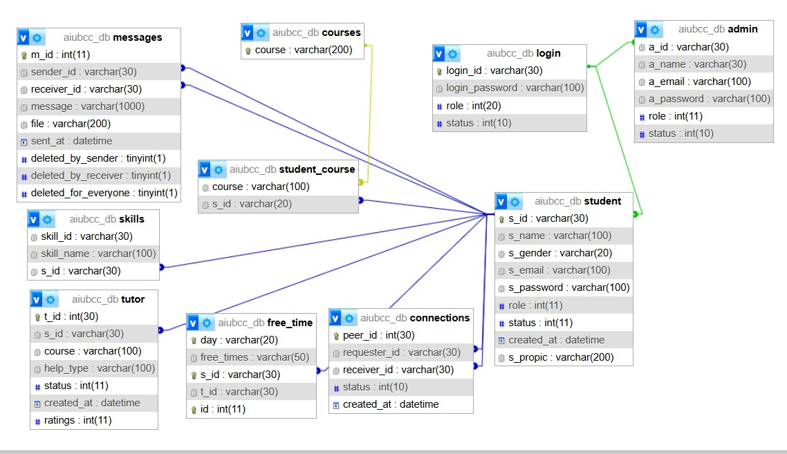

<div align="center">


# 🎓 AIUB CampusConnect

### Connecting AIUB students, one course at a time.

*A student-to-student tutoring and academic support platform for AIUB.*

</div>

---

This is a project made by **Rafit Rahad** and **Kazi Ayesha** for our **Web Technologies course at American International University-Bangladesh (AIUB)**.

**AIUB CampusConnect** was built around a simple idea: university life becomes a lot easier when students can find the right people to help them.

For students taking **open credit courses**, finding someone who has already completed the course, understands the common struggles, or can provide tutoring can be surprisingly difficult. Instead of depending on random posts or asking around, AIUB CampusConnect brings students and student tutors together in one place.

Students can find people taking similar courses, search for tutors, match with students based on **courses, skills, and free time**, and communicate directly through the platform.

At the same time, students who are confident in a subject can offer academic help by registering themselves as tutors for specific courses.

> **Students helping students survive university together.**

---

# 🛠️ Technologies & Tools

<div align="center">


&nbsp;&nbsp;

&nbsp;&nbsp;

&nbsp;&nbsp;

&nbsp;&nbsp;

&nbsp;&nbsp;

&nbsp;&nbsp;


<br><br>

**HTML5 • CSS3 • JavaScript • PHP • MySQL • phpMyAdmin • XAMPP • PHPMailer**

</div>

### 🎨 Frontend
- **HTML5** — Web page structure
- **CSS3** — Styling, layouts, themes, and interface design
- **JavaScript** — Client-side interaction, AJAX functionality, validation, and theme switching

### ⚙️ Backend
- **PHP** — Server-side logic, authentication, validation, sessions, and database operations
- **PHPMailer** — Email and OTP functionality

### 🗄️ Database
- **MySQL** — Relational database management
- **phpMyAdmin** — Database creation, administration, and testing

### 💻 Development Environment
- **XAMPP** — Apache, PHP, and MySQL local development environment

---

# 🏗️ Project Structure

AIUB CampusConnect follows an **MVC-style project structure**, separating database operations, application logic, and interface components.

```text
AiubCampusConnect/
│
├── Controller/
├── Model/
├── PHPMailer/
├── Resources/
│
├── View/
│   ├── admin/
│   │   ├── adminHome.php
│   │   ├── editUser.php
│   │   ├── admin.css
│   │   └── admin.js
│   │
│   ├── student/
│   │   ├── signUpView.php
│   │   ├── emailVerificationView.php
│   │   ├── studentHome.php
│   │   ├── studentProfileView.php
│   │   ├── studentCourseView.php
│   │   ├── tutorHomeView.php
│   │   ├── addSkillView.php
│   │   ├── studentHome.css
│   │   └── studentHome.js
│   │
│   ├── loginView.php
│   ├── forgetPasswordView.php
│   ├── changePasswordView.php
│   ├── messageView.php
│   └── setFreeTimeView.php
│
├── database/
│   └── aiubcc_db.sql
│
├── screenshots/
│   ├── login.png
│   ├── student-dashboard.png
│   ├── messages.png
│   ├── admin-dashboard.png
│   └── database-schema.jpeg
│
├── assets/
│   └── aiub-logo.png
│
├── index.php
└── README.md
```

---

# 🗄️ Database Design & Development

AIUB CampusConnect uses a **MySQL relational database** named `aiubcc_db`.

Before implementing the database, we planned how the different parts of the system would connect and created an **Entity Relationship Diagram (ER Diagram)**.

We then applied **database normalization** to organize the data properly, reduce unnecessary duplication, and maintain consistency between related information.

### Database Development Process

1. Identified the main entities of the system
2. Determined the required attributes
3. Designed the **ER Diagram**
4. Defined relationships between entities
5. Applied **database normalization**
6. Reduced data redundancy
7. Defined primary keys and related attributes
8. Converted the ER design into relational tables
9. Implemented the schema using **MySQL**
10. Managed and tested the database using **phpMyAdmin**
11. Connected the database to the PHP backend
12. Implemented CRUD and other database operations

### Main Tables

| Table | Purpose |
|------|---------|
| `student` | Stores student account and profile information |
| `login` | Stores authentication, role, and account-status information |
| `admin` | Stores administrator information |
| `courses` | Stores available course information |
| `student_course` | Connects students with their selected courses |
| `skills` | Stores skills associated with students |
| `tutor` | Stores tutoring courses, help types, status, and ratings |
| `free_time` | Stores student availability |
| `messages` | Stores messages, files, timestamps, and deletion information |
| `connections` | Stores communication relationships between users |

### Database Relationship Diagram

<p align="center">
  
</p>

The database connects student accounts with their **courses, skills, tutoring information, free time, messages, and connections**, while keeping authentication and administration organized separately.

The complete SQL database file is available at:

```text
database/aiubcc_db.sql
```

---

# ✨ Main Functionalities

## 🔐 1. Registration & Email Verification

Students can register using their AIUB student information and verify their account through email.

**Functionalities:**
- Student registration
- AIUB email validation
- Input validation
- Password-strength validation
- Optional profile-picture upload
- Student ID extraction from AIUB email
- Secure password hashing
- Six-digit OTP generation
- OTP verification
- Resend OTP
- PHPMailer-based email delivery

---

## 🔑 2. Login & Role-Based Authentication

The system provides separate access for students and administrators.

**Functionalities:**
- Login using Student/User ID
- Password verification
- Session-based authentication
- Account-status checking
- Role-based access control
- Student Dashboard redirection
- Admin Dashboard redirection
- Protection of restricted pages

### Login Page

<p align="center">
  
</p>

---

## 🔄 3. Forgot & Change Password

Users can recover a forgotten password or securely change their current password.

**Functionalities:**
- Forgot-password recovery
- Registered email verification
- OTP generation
- OTP verification
- Resend OTP
- New-password validation
- Confirm-password validation
- Secure password hashing
- Existing-password verification

---

## 🏠 4. Student Dashboard

The Student Dashboard acts as the central hub for the student side of CampusConnect.

**Functionalities:**
- Personalized dashboard
- Profile information
- Profile-picture display
- View skills
- View courses
- View tutoring courses
- View free-time information
- Search students
- Search tutors
- Access matching systems
- Access messages
- Access profile settings
- Light/Dark mode switching

### Student Dashboard

<p align="center">
  
</p>

---

## 👤 5. Student Profile Management

Students can manage their personal information and account.

**Functionalities:**
- View profile information
- Update name
- Update gender
- Change profile picture
- Change password
- Activate or deactivate account
- Delete account
- Manage account-related information

---

## 📚 6. Course Management

Students can add courses they are currently taking.

**Functionalities:**
- Add courses
- Search courses while typing
- AJAX course suggestions
- Prevent duplicate course entries
- View selected courses
- Remove courses
- Use course information for matching

---

## 🤝 7. Course Matching

CampusConnect can find other students who are taking the same courses.

**Functionalities:**
- Compare courses between students
- Find students with common courses
- Display matched student information
- Display common course
- Prevent self-matching
- Direct messaging from match results

This feature is especially helpful for **open credit students** who may not already know other students taking the same course.

---

## 🧠 8. Skill Management & Skill Matching

Students can add their skills and find other students who share similar skills.

**Functionalities:**
- Add personal skills
- Validate skill input
- Store multiple skills
- Display skills
- Compare skills between students
- Identify common skills
- Find matching students
- Direct messaging from match results

---

## 🎓 9. Student Tutor System

Students can offer academic help without needing a separate tutor account.

**Functionalities:**
- Register as a tutor for specific courses
- Add multiple tutor courses
- Search available courses
- Select type of help:
  - **Project**
  - **Exam**
- View tutoring courses
- Remove tutoring courses
- Tutor using the same student account

---

## 🔍 10. Tutor Search

Students can search for other students offering tutoring for a particular course.

**Functionalities:**
- Search tutors by course
- Live AJAX tutor search
- Partial course-name matching
- Display tutor name
- Display Student ID
- Display profile picture
- Display tutoring course
- Display **Project / Exam** help type
- Direct messaging from search results

> Need help with **Web Technologies**? Search for the course and find another student offering help with projects or exams.

---

## ⏰ 11. Free-Time / Break-Time Matching

Students can enter their university free periods and find people who are available at the same time.

**Functionalities:**
- Set availability from Sunday to Thursday
- Select multiple time slots
- Save free time
- Update existing availability
- Remove availability
- Compare free periods
- Find students with overlapping breaks
- Prevent self-matching
- Directly message matched students

This makes it possible to find someone who is academically relevant **and actually free at the same time**.

---

## 🔎 12. Smart Student Search

Students can search for other CampusConnect users directly from the dashboard.

**Functionalities:**
- Live AJAX search
- Search by student name
- Search by course
- Search by skill
- Display Student ID
- Display profile picture
- Display matching information
- Exclude the logged-in user
- Show active users
- Direct messaging from search results
- Debounced search requests

---

## 💬 13. Messaging System

CampusConnect includes a built-in messaging system for communication between students and tutors.

**Functionalities:**
- Send messages
- Receive messages
- Search users by name or ID
- Open conversations directly from search and matching results
- AJAX-based message refreshing
- Message timestamps
- Message Requests for new conversations

### 📎 File Sharing

Users can send:

- JPG images
- PNG images
- PDF files

### 🗑️ Message Controls

Users can:

- Delete a message for themselves
- Delete their own sent message for everyone
- Delete an entire chat for themselves

### 🚫 Blocking

Users can:

- Block another user
- Unblock another user
- Prevent communication between blocked users

### Messaging System

<p align="center">
  
</p>

---

## 🛡️ 14. Admin Dashboard

Administrators have a separate dashboard for managing CampusConnect.

**Functionalities:**
- View registered users
- Search users by ID
- Search users by name
- Search users by email
- Add users
- Edit users
- Delete users
- Change user roles
- Activate accounts
- Deactivate accounts
- Update user information
- Admin logout

### CRUD Operations

- **Create** — Add new users
- **Read** — View and search users
- **Update** — Edit user information
- **Delete** — Remove users and associated records

### Admin Dashboard

<p align="center">
  
</p>

---

## 🌙 15. Light & Dark Mode

CampusConnect includes theme switching for its main dashboards.

**Functionalities:**
- Light Mode
- Dark Mode
- One-click theme toggle
- Student Dashboard theme switching
- Admin Dashboard theme switching
- Theme preference persistence using `localStorage`

---

# ⚡ AJAX-Based Features

JavaScript and AJAX are used throughout CampusConnect to provide a smoother user experience without requiring complete page reloads.

AJAX is used for features such as:

- Student search
- Tutor search
- Course suggestions
- Message updates
- Account-status updates
- Interactive dashboard features

---

# 🔒 Security & Validation

Several validation and security techniques are implemented throughout the project.

- Password hashing
- Session-based authentication
- Role-based authorization
- Email verification
- OTP verification
- Server-side validation
- Client-side validation
- Account-status verification
- Restricted-page protection

---

# 🚀 How to Run the Project

### 1. Install XAMPP

Install **XAMPP** on your computer.

### 2. Place the Project in `htdocs`

Move or clone the project into:

```text
C:\xampp\htdocs\AiubCampusConnect
```

### 3. Start the Server

Open **XAMPP Control Panel** and start:

- Apache
- MySQL

### 4. Create the Database

Open:

```text
http://localhost/phpmyadmin/
```

Create a database named:

```text
aiubcc_db
```

### 5. Import the Database

Import:

```text
database/aiubcc_db.sql
```

into `aiubcc_db`.

### 6. Run CampusConnect

Open:

```text
http://localhost/AiubCampusConnect/
```

---

# 🎯 What We Learned

Through the development of AIUB CampusConnect, we gained practical experience with:

- Full-stack web development
- HTML, CSS, and JavaScript
- PHP backend development
- MySQL database design
- ER diagrams
- Database normalization
- CRUD operations
- MVC-style project organization
- Authentication and authorization
- Session management
- Password hashing
- OTP verification
- AJAX
- File uploading
- Email integration
- User-to-user messaging
- Role-based systems
- Relational database relationships

---

# 🎓 Academic Information

**Course:** Web Technologies  
**Institution:** American International University-Bangladesh (AIUB)  
**Project:** AIUB CampusConnect

---

<div align="center">

## 👩‍💻 Developers

**Rafit Rahad**  
**Kazi Ayesha**

<br>

Made for the **Web Technologies Course at AIUB**

### 💙 Students helping students.

</div>
